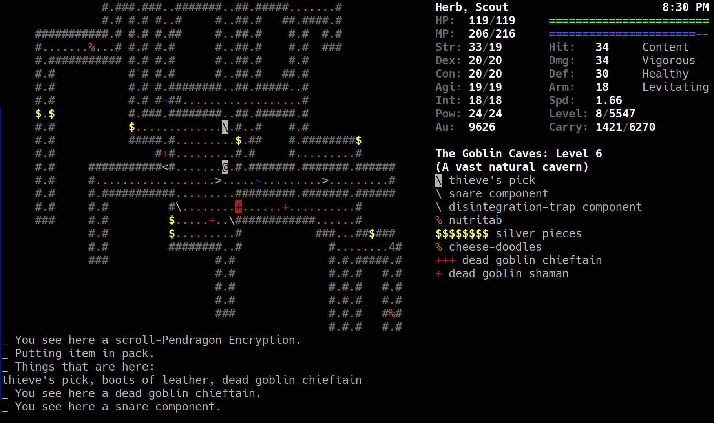

# Omega

My C++ fork of the 1987 roguelike "Omega", featuring numerous bug-fixes as well as balance and UI improvements.


## Build Instructions

### Linux

On distros with GCC versions >= 13, you can perform the following steps:

```
git clone https://github.com/Lyle-Tafoya/Omega.git
mkdir Omega/build
cd Omega/build
cmake ..
cmake --build .
```

#### Ubuntu

```
sudo add-apt-repository ppa:ubuntu-toolchain-r/test
sudo apt update
sudo apt install g++-13
git clone https://github.com/Lyle-Tafoya/Omega.git
mkdir Omega/build
cd Omega/build
CXX=g++-13 cmake ..
cmake --build .
```

### MacOS

Tested on macOS 15.7.1

```
brew install cmake
git clone https://github.com/Lyle-Tafoya/Omega.git
mkdir Omega/build
cd Omega/build
cmake ..
cmake --build .
```


### Windows

I have been building Omega for Windows using NMake from the "x64 Native Tools Command Prompt for VS 2022"

```
git clone https://github.com/Lyle-Tafoya/Omega.git
mkdir Omega\build
cd Omega\build
cmake .. -G "NMake Makefiles" -DCMAKE_BUILD_TYPE=Release
cmake --build .
```

By default, Omega will run in an OpenGL window. To run in the Windows terminal instead, you can build with the following commands:

```
git clone https://github.com/Lyle-Tafoya/Omega.git
mkdir Omega\build
cd Omega\build
cmake .. -G "NMake Makefiles" -DCMAKE_BUILD_TYPE=Release -DPDC_GL_BUILD=OFF
cmake --build .
```
